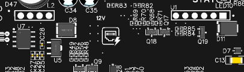

# ESP-R8-POE-3C SETUP GUIDE

(For Homeassistant and ESPHome)


### Board Layout


### Requirements

- TCP/IPv4 network (Wifi or Ethernet).

- Existing Homeassistant server with ESPHome add-on running on the same network on which you intend to set up the ESP-R8-POE-3C board.

- PC/Mac or Android/iOS mobile device which is able to access the Homeassistant Lovelace web interface or running the Homeassistant app.

- IEEE 802.3at PoE-capable network switch or 12 volt DC power supply capable of supplying at least 2 amps.

- *(FOR 2310 SERIES AND BELOW)* USB-serial programming module to flash ESPHome firmware.

- *(FOR 2319 SERIES AND UP)* USB-A to USB-C cable or USB-C to USB-C cable (depending on your host device) with power/ground and D+/D- conductors present.

### 

### Creating the ESPHome YAML configuration file

You must have the ESPHome addon installed and running in Homeassistant before proceeding with these steps.

Log in to your Homeassistant instance and navigate to "Settings", "Addons","ESPHome" and click "OPEN WEB UI":


Click "NEW DEVICE":


If the following warning pops up, it means your web browser does not support WebSerial, and you cannot upload firmware via USB using the web browser, and must use a standalone firmware utility program or switch to a compatible web browser.  Click continue for now to create the configuration file:


Name your device and click "NEXT":


If you see the following message, click "SKIP THIS STEP":


Select "ESP32" for device type:


You should see a message similar to the following if the configuration file has been successfully created.  Click "SKIP".


Click "EDIT" on the newly created configuration:


Replace the YAML code in the file with the following example code.  This default configuration will get all 8 relay outputs, dry-contact closure inputs, real time clock, Ethernet, status LED, and GPIO ports functioning with Homeassistant.  Change the IP address information to match your network. Click "SAVE" when done and then "X" to exit the editor.  To use Wifi instead of Ethernet, comment out the "Ethernet" section in the YAML code below and uncomment the "Wifi" section.


<mark>**Make sure DIP switch 3 (PHY_POWER) is on if using Ethernet.**</mark>


### YAML Example Configuration

```yaml
esphome:
  name: esp-r8-poe-3c-example # Replace with your custom name.
  platform: ESP32
  board: esp32dev
# Enable logging
logger:

# Enable Home Assistant API
api:

ota:

ethernet:
  type: LAN8720
  mdc_pin: GPIO23
  mdio_pin: GPIO18
  clk_mode: GPIO0_IN
  phy_addr: 1
  power_pin: GPIO17

# To use Wifi instead of Ethernet, comment out the "Ethernet" section 
# above and uncomment the "wifi" section below, and change the SSID
# and password to match your network.
#wifi:
#  ssid: MyWifiNetwork
#  password: MyPassword

# Manual IP.  Replace with your specific network information.
  manual_ip:
    static_ip: 192.168.10.195
    gateway: 192.168.10.1
    subnet: 255.255.255.0

status_led:
  pin: GPIO14

i2c:
   - id: bus_a
     sda: 32
     scl: 33
     scan: True

time:
  - platform: ds1307
    update_interval: never
    id: on_board_time
  - platform: homeassistant
    id: homeassistant_time
    on_time_sync:
      then:
        ds1307.write_time:


pcf8574:
  - id: 'output_expander'
    address: 0x23
    pcf8575: False
  - id: 'input_expander'
    address: 0x25
    pcf8575: False

# Individual outputs
switch:
  - platform: gpio
    id: relay_1
    name: "Relay 1"
    pin:
      pcf8574: output_expander
      # Use pin number 0
      number: 0
      # One of INPUT or OUTPUT
      mode: OUTPUT
      inverted: True

  - platform: gpio
    name: "Relay 2"
    pin:
      pcf8574: output_expander
      # Use pin number 1
      number: 1
      # One of INPUT or OUTPUT
      mode: OUTPUT
      inverted: True

  - platform: gpio
    name: "Relay 3"
    pin:
      pcf8574: output_expander
      # Use pin number 2
      number: 2
      # One of INPUT or OUTPUT
      mode: OUTPUT
      inverted: True

  - platform: gpio
    name: "Relay 4"
    pin:
      pcf8574: output_expander
      # Use pin number 3
      number: 3
      # One of INPUT or OUTPUT
      mode: OUTPUT
      inverted: True

  - platform: gpio
    name: "Relay 5"
    pin:
      pcf8574: output_expander
      # Use pin number 4
      number: 4
      # One of INPUT or OUTPUT
      mode: OUTPUT
      inverted: True

  - platform: gpio
    name: "Relay 6"
    pin:
      pcf8574: output_expander
      # Use pin number 5
      number: 5
      # One of INPUT or OUTPUT
      mode: OUTPUT
      inverted: True

  - platform: gpio
    name: "Relay 7"
    pin:
      pcf8574: output_expander
      # Use pin number 6
      number: 6
      # One of INPUT or OUTPUT
      mode: OUTPUT
      inverted: True

  - platform: gpio
    name: "Relay 8"
    pin:
      pcf8574: output_expander
      # Use pin number 7
      number: 7
      # One of INPUT or OUTPUT
      mode: OUTPUT
      inverted: True

binary_sensor:
  - platform: gpio
    filters:
      - invert:
    pin:
      pcf8574: input_expander
      number: 0
      mode: INPUT
    name: "Input 1"
  - platform: gpio
    filters:
      - invert:
    pin:
      pcf8574: input_expander
      number: 1
      mode: INPUT
    name: "Input 2"
  - platform: gpio
    filters:
      - invert:
    pin:
      pcf8574: input_expander
      number: 2
      mode: INPUT
    name: "Input 3"
  - platform: gpio
    filters:
      - invert:
    pin:
      pcf8574: input_expander
      number: 3
      mode: INPUT
    name: "Input 4"
  - platform: gpio
    filters:
      - invert:
    pin:
      pcf8574: input_expander
      number: 4
      mode: INPUT
    name: "Input 5"
  - platform: gpio
    filters:
      - invert:
    pin:
      pcf8574: input_expander
      number: 5
      mode: INPUT
    name: "Input 6"
  - platform: gpio
    filters:
      - invert:
    pin:
      pcf8574: input_expander
      number: 6
      mode: INPUT
    name: "Input 7"
  - platform: gpio
    filters:
      - invert:
    pin:
      pcf8574: input_expander
      number: 7
      mode: INPUT
    name: "Input 8"

  - platform: gpio
    id: GPIO13
    pin:
      number: 13
      mode: INPUT_PULLUP
  - platform: gpio
    id: GPIO17
    pin:
      number: 17
      mode: INPUT_PULLUP
```


### Flashing firmware to the ESP-R8-POE-3C using a USB cable

##### 2319 series and up

Plug a USB-A to USB-C or USB-C to USB-C cable from your computer to the USB-C port on the left side of the board.  Your operating system should already have the drivers for the USB-Serial chip, but if not, click the link below to download and install them.  Mac users may have to disable some security features.

[CP210x USB to UART Bridge VCP Drivers - Silicon Labs](https://www.silabs.com/developers/usb-to-uart-bridge-vcp-drivers)

##### 2310 series and below

Plug a USB-Serial programming module from your computer into the H1 programming header, taking care to connect it according to the labeled pinout.  RX on the module goes to TX on the board, and vise-versa.  Connect both grounds together.  Set the module to 3.3 volts if it has such an option.


You will have to put the board into bootloader mode after powerup by holding down the "BOOT" and "EN" buttons at the same time, releasing the "EN" button, and after about two seconds, release the "BOOT" button.  After firmware flashing is complete, you will have to press the "EN" button once to reset the board.


##### Power

<mark>**If you are using Wifi, please connect an antenna to the antenna connector before powering on the board. If the Wifi radio turns on without a load attached, there is a chance that the ESP32 module may be damaged.**</mark>

Supply 12 volts DC to the power input terminal, noting correct polarity.


Alternatively, you can also insert the BPI-7402 module into the U1 header on the board and plug in an Ethernet cable connected to a PoE switch into the Ethernet socket.  The module will only fit one way, with the 6 pin header on the right next to the Ethernet socket and the 4 pin header on the left next to the expansion header.





Both power supplies may be connected at the same time for redundancy/failover if desired.  The board will *not* draw power from the USB connection, and power must be supplied externally while programming.


##### Using the ESPHome web interface

This requires a compatible browser. In the ESPHome web interface, click the three dots on your new device configuration and select "Install":


Select "Plug into this computer":


Select the correct COM port from the dialog box that pops up and click "Connect".  In my case, it's "CP2102 USB to UART Bridge Controller (ttyUSB0)".  You should see something similar.


The board will automatically enter bootloader mode.  Please wait while the firmware is being built and downloaded to the board.  You may have to push the "EN" button to reset the board when done if the web interface doesn't already do it for you.


When it finishes, you should see a message similar to this:


Your ESP-R8-POE-3C board should now be online, and Homeassistant should be able to detect the device on your network.  Check the "notifications" section for newly discovered devices to add.


##### Using the ESPHome Flasher tool

The following section uses the ESPHome Flasher tool.  Download and install it for your operating system at the following URL before proceeding if you do not already have it:

[Releases · esphome/esphome-flasher · GitHub](https://github.com/esphome/esphome-flasher/releases)

Click on the three dots on your ESPHome device configuration and click "Install".


Select "Manual download".


Select "Legacy format".


The ESPHome firmware will then begin compiling.  When it is finished, click the "Download" link in the lower right corner of the window.


Save the file to your device in a location where you can find it again in a moment.  Now power up the board as described in the "Power" section of this document and connect a USB-C cable or USB-serial programming module if you have not already done so. If using a USB-serial programming module, you will have to put the board into bootloader mode manually.  Then run the ESPHome Flasher utility. Click on the field next to "Serial port" and select your programming device.


Click "Browse", and find the firmware *.bin file you created and downloaded earlier. Then click "Flash ESP". The program should take a couple minutes to erase and reprogram the board. If it does not automatically reset, press the "EN" button.


The ESP-R8-POE-3C should now be discoverable by Homeassistant if all goes well.


### Flashing firmware to the ESP-R8-POE-3C using Wifi and OTA update

The ESP-R8-POE-3C boards come preloaded with a version of the ESPHome firmware that is configured to broadcast a Wifi AP on first boot and allow you to load custom firmware from a web interface.

Power on the board as described in the "Power" section above.  You do not need a USB-C cable or USB-serial programming module for this. Use a Wifi-capable device such as a laptop or mobile phone/tablet to connect to the SSID called "ESP-R8-POE-3C-setup".


If a web browser does not automatically launch after connecting, then just run one manually and browse to the address "192.168.4.1".  After the page loads, scroll down to the bottom, and there will be a dialog box allowing you to select the firmware file and upload it.


### Features

The follwing section describes various components of the ESP-R8-POE-3C. 

##### Configuration DIP switches


The bank of DIP switches on the board to the left of the battery holder is intended for enabling or disabling certain features.  They are as follows:

- **Switch 1**: Enable or disable the 10kΩ pullup resistors on the IO4 terminal.

- **Switch 2**: Enable or disable the 10kΩ pullup resistors on the IO5 terminal.

- **Switch 3:** Disconnects GPIO17 from the Ethernet clock enable line and allows for the use of it on the expansion header in the middle of the board.  Any custom projects cannot use this GPIO and Ethernet at the same time.

- **Switch 4**: Enable or disable the interrupt output of the PCF8574 input expander on GPIO13, which is also exposed on the expansion header.

##### 

##### Input terminals


The 8 input terminals across the top of the board allow you to monitor circuits for open or closure events. The inputs are normally pulled up to 3.3 volts by a resistor (logic "1/true"), and shorting an input terminal to a "C" terminal or ground will pull it low and register a logic "0/false".

The terminals are connected to a PCF8574 GPIO expander, which is itself connected to the ESP32's I2C bus at address 0x25.

<mark>**These terminals are designed for for a maximum input voltage of 3.3 volts.**</mark>


**Typical example:**


##### 

##### GPIO terminals


The two terminals labeled "IO4" and "IO5" are directly connected to the ESP32's GPIO4 and GPIO5 ports.  They are general purpose ports which can be used for anything you may need in your project.  Please be aware that these inputs are protected by TVS and zener diodes for ESD and overvoltage protection. These diodes add a small bit of capacitance to the lines, and may affect very high speed signals.

<mark>**These terminals are designed for for a maximum input voltage of 3.3 volts.**</mark>


##### Relay outputs

There are 8 SPDT relays on the ESP-R8-POE-3C which allow control of various types of circuits. They are controlled by a PCF8574 GPIO expander at address 0x23 on the I2C bus. The PCF8574 outputs are "active-low", as in, if you change an output from high to low, the relay for that pin will turn on. It was designed as active-low to avoid relay chatter when the PCF8574 and ESP32 power up so as to not accidentally trigger downstream devices unintentionally.

The relay outputs are rated at a maximum of 10 amps at 250 volts AC or 30 volts DC (try not to push it right up to these limits. I recommend to leave about 20% or so of overhead). <mark>**Damage or fire may occur if these limits are exceeded.**</mark> Fuses are highly recommended at higher currents to protect the relay from short circuits or excessive current if using an external power supply.  The board's own auxiliary power output is protected by a 750mA resettable PTC fuse if you are using that to power external devices.

NO = Normally open terminal

C = Common terminal

NC = Normally closed terminal


**Typical example:**


<mark>**If you are planning to use inductive DC loads such as motors or solenoids, it is highly recommended to fit an inductive kickback suppression diode on the device's power connections to avoid arcing on the relay contacts and potentially destroying them.**</mark>

##### 

##### Auxiliary power output


The AUX terminal allows you to power external 12 volt DC devices with up to 750mA of total current. Examples of this includes alarm sirens, electric door strikes, LEDs, card readers, motion detectors, and more. A resettable fuse protects against excessive current or short circuits. 

##### 

##### 12 volt DC Power input


This terminal allows you to power the ESP-R8-POE-3C from one of two power sources (the other being PoE from the Ethernet socket). Connect a 12 volt DC supply capable of supplying at least 2 amps of current to this terminal, making sure to observe the correct polarity as marked on the terminal. This power input may be used in conjunction with the PoE power supply as a redundancy or backup. Steering diodes on the board will prevent the power supplies from interfering with each other.

##### 

##### Ethernet


Ethernet connectivity is provided by a LAN8720 Ethernet PHY IC capable of running at 100Mbit/s full duplex. It uses RMII mode for communication with the ESP32 and also uses a dedicated external 50Mhz oscillator. The following table describes the connections between the PHY and the ESP32:

| ESP32           | LAN8720               |
|:--------------- | --------------------- |
| Pin 11 (GPIO26) | Pin 7 (RXD1/MODE1)    |
| Pin 10 (GPIO25) | Pin 8 (RXD0/MODE0)    |
| Pin 12 (GPIO27) | Pin 11 (CRS_DV/MODE2) |
| Pin 30 (GPIO18) | Pin 12 (MDIO)         |
| Pin 37 (GPIO23) | Pin 13 (MDC)          |
| Pin 25 (GPIO0)  | Pin 14 (nINT/REFCLKO) |
| Pin 33 (GPIO21) | Pin 16 (TXEN)         |
| Pin 31 (GPIO19) | Pin 17 (TXD0)         |
| Pin 36 (GPIO22) | Pin 18 (TXD1)         |
| Pin 28 (GPIO17) | (PHY_POWER)           |

The PHY_POWER pin (GPIO17) must be pulled high for the 50Mhz oscillator to run.
There is a pulldown resistor on this pin to give it a default low state which disables the PHY. Connection to this pin is also controlled by configuration DIP switch 3. Turn the switch on to activate the PHY's oscillator, 

##### 

##### PoE (Power over Ethernet)


The ESP-R8-POE-3C is capable of being powered by a PoE-enabled network switch. Insert the BPI-7402 module into the U1 headers and connect one end of a CAT5e/CAT6 Ethernet cable to the Ethernet socket, and the other end to the PoE switch.

The board will also still provide regulated 12 volt DC power from its auxiliary power terminal when powered this way. This means that you can have a fully self-contained system with peripheral devices all powered off the PoE switch, as long as the combined current draw does not exceed 750mA.

<mark>**Do not remove or insert the BPI-7402 module while the ESP-R8-POE-3C is powered on. There is around 48 volts of PoE power at the input of this module, and while there is a TVS diode to hopefully protect things at the input, mishaps can still happen and send that 48 volts somewhere it is really not supposed to be. It was not designed for hot-swapping in mind.**</mark>

##### 

##### DS1307 Real time clock

There is an oboard DS1307 RTC available for use at I2C 0x68. Insert a 3 volt CR1220 coin cell battery into the BT1 battery holder to keep time when the board is powered off.


##### Expansion header


This header is meant to be used for add-on boards or custom projects/PCBS in whatever way you wish. 12 and 3.3 volts is provided as well as the I2C bus, and IO4 and IO5 ports are also broken out on the screw terminals. 

<mark>**Please note, when Ethernet is in use, IO17 is used as the PHY_POWER pin and cannot be used on this header at the same time.**</mark>

##### Programming header and buttons


Programming header H1 is provided for you to be able to use a USB-serial module for programming if for whatever reason you do not want to or cannot use the onboard USB-C port. The two buttons will allow you to manually put it into bootloader mode by holding down both at the same time, releasing the "EN" button, and then after waiting for one second, releasing the "BOOT" button. A regular reset can be done by pressing "EN" once.

##### 

##### Antenna connector


A standard female SMA connector is provided to have the option of using any sort of antenna you wish, as well as other equipment like Wifi amplifiers, instead of being limited to an onboard PCB antenna or U.FL connector. 

<mark>**Please connect an antenna before powering on the ESP-R8-POE-3C when using Wifi. If the Wifi radio turns on without a load attached, there is a chance that the ESP32 module may be damaged.**</mark>

### 

### Notes

- There are six mounting holes on the PCB which will accomodate M3 screws to mount the board to standoffs or other mounting hardware. The top five holes have their annular rings connected to the common system ground, and can be connected to Earth ground for additional ESD safety.

- When using a separate power supply to power downstream devices through the relays, it is recommended to install a fuse to avoid burning out the relay contacts in case of a fault if it does not already have a means to limit the current.

### 

### Technical specifications

Input voltage (external): 12 volts

Input voltage (PoE): 48 volts

PoE specification: IEEE 802.3at

Aux output voltage: ~12 volts

Maximum aux output current: 750 milliamps

Ethernet: 100BASE-T full duplex

Wifi: 2.4Ghz 802.11b/g/n

Maximum relay contact current: 10 amps

Maximum relay contact voltage (AC): 250 volts

Maximum relay contact voltage (DC): 28 volts

Maximum input terminal and IO terminal voltage: 3.3 volts

### 

### Links

[EasyEDA schematic](blob/main/design_files/SCH_ESP-R8-POE-3C v2_2023-10-08.json)

[EasyEDA PCB layout](blob/main/design_files/PCB_PCB_ESP_R8_POE_3C v2_2023-10-08.json)

[Pick and place file](blob/main/design_files/PickAndPlace_PCB_ESP_R8_POE_3C v2_2023-10-08.csv)

[Gerber file](blob/main/design_files/Gerber_PCB_ESP_R8_POE_3C v2.zip)

[PDF schematic](blob/main/design_files/Schematic_ESP-R8-POE-3C v2_2023-10-08.pdf)

[License](license.txt)
